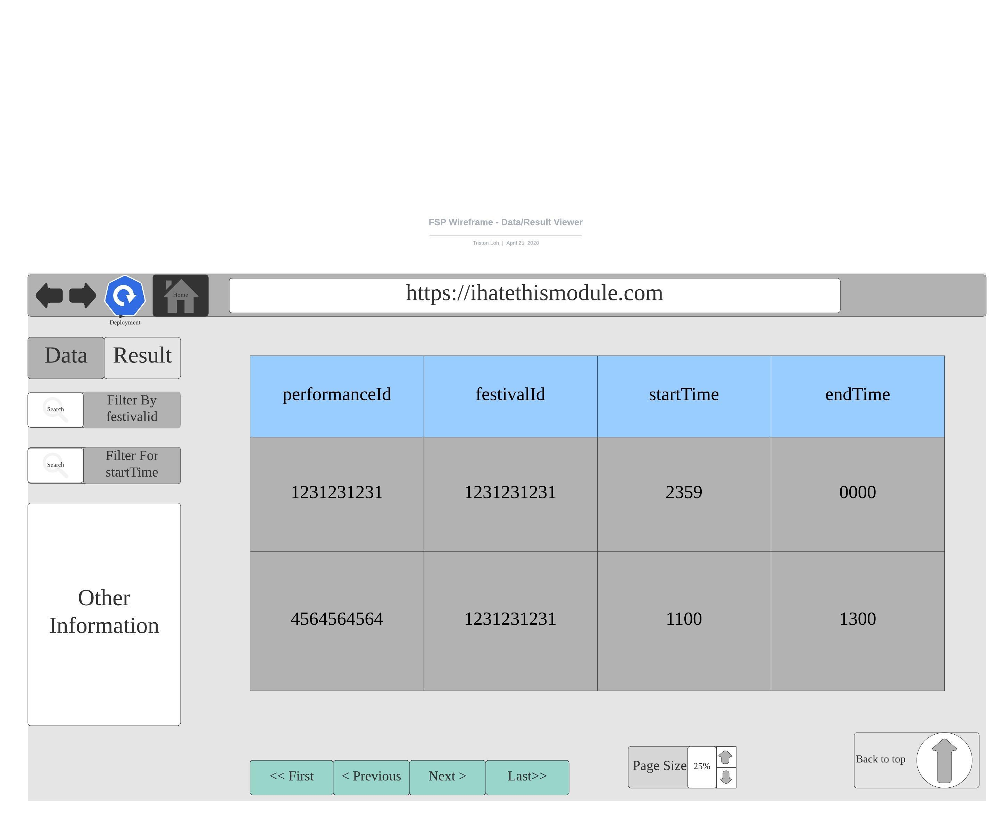

# Wireframe & Justification

This document should help you explain how your user interfaces are designed. You should have a wireframe to give a good overview and some screenshot with simple writeups to justify your designs.

## Wireframe

## Justifications

### Justification 1

#### Good Points

1. Attributes shown at top and bottom can be useful for big table.
2. Showing total number of entries can be useful for some instance.
3. Pagination tool meets requirement

#### Bad Points

1. May need more than 1 search bar as we need to search by multiple attributes
2. Data with many column may be bad.

### Justification 2

#### Good Points

1. Attributes shown at top and bottom can be useful for big table.
2. Showing total number of entries can be useful for some instance.
3. Pagination tool meets requirement

#### Bad Points

1. May need more than 1 search bar as we need to search by multiple attributes
2. Data with many column may be bad.

### Justification 3

> Find more existing work for reference.
