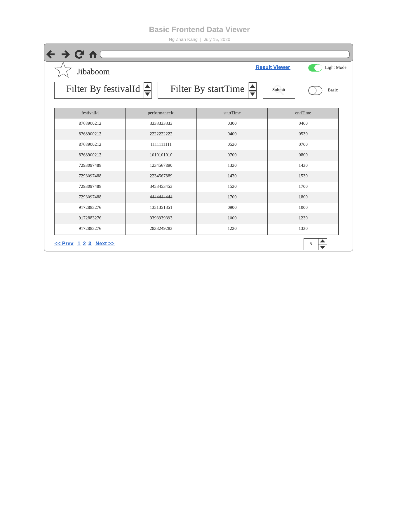

# Wireframe & Justification

This document should help you explain how your user interfaces are designed. You should have a wireframe to give a good overview and some screenshot with simple writeups to justify your designs.

## Wireframe

## Justifications

### [Justification 1 - Data Viewer](https://www.eventbrite.sg/d/singapore--singapore/events--this-weekend/music-festival/?page=1)

#### Good Points
1. Good layout of filters. There are subcategories within categories.
2. Does not mislead users with its easy functions.
3. Very systematic in a way such that after filtering, the results that pop up are not messy and instead is produced in an orderly manner.
4. There are labels on the results which tells people if the event is free or tickets are sold out. This gives more information to people so that they have a better understanding of the event before they decide on which event to go to.
5. Has proper pagination functions to go to next page and previous page. This allows easy access to see all the results.

#### Bad Point

1. Too many options. Could have been presented such that a calander is shown instead for the user to personally choose his/her desired date.
2. When the page is scrolled down, the footer is not fixed and hence will block part of the filter. They could have fixed the footer at the bottom so that it will not block.

### [Justification 2 - Data Viewer](https://obs.sportshub.com.sg/view/2483/ocbc-arena)

#### Good Points

1. Allow users to select the specific date they want to attend the concert by displaying a dropdown.
2. White background to let user see the information clearly.
3. Also filters the type of sports user wants and displays all the corresponding available timings.
4. Provides all the necessary information at the right side of the page such as the opening hours, contact details, map location, etc.
5. Provides an overview so that the user know what this webpage is about.

#### Bad Points

1. Only shows limited dates and does not show dates and timing for 2 weeks into the future. This restricts users to plan ahead of time to get a booking down.
2. The table of results after filter could have been presented in a nicer format whereby the timings are also shown and not just the sport.

### [Justification 3 - Data Viewer](https://www.cathaycineplexes.com.sg/)

#### Good Points

1. A dropdown list to let users choose between the venue instead of letting them type themselves.
2. 4 different categories(filters) for the users to narrow down their selection. 
3. The 'Select Time' option is only made available if users added in the 3 other filters, namely: the Movie Name, cinema venue and date of screening. Thereby, making use of soft power to make users insert in the 1st 3 variables before they can pick the timing that they want to see.

#### Bad Points

1. Options for the users to choose the date and time is too small/ placed and squeezed at the top. Old/elder users who might not be tech-savvy or not alert might have accidentally skipped that part.
2. They could have possibly tried to fit in the data on the filter page itself instead of going to the next page so that they can edit the fiter if they want to see the other available slots instead of going back to the previous page to change it.
3. The data could have been presented in a table format so that it is more user friendly and is more feasible to the eye. This allows users to understand the data better.