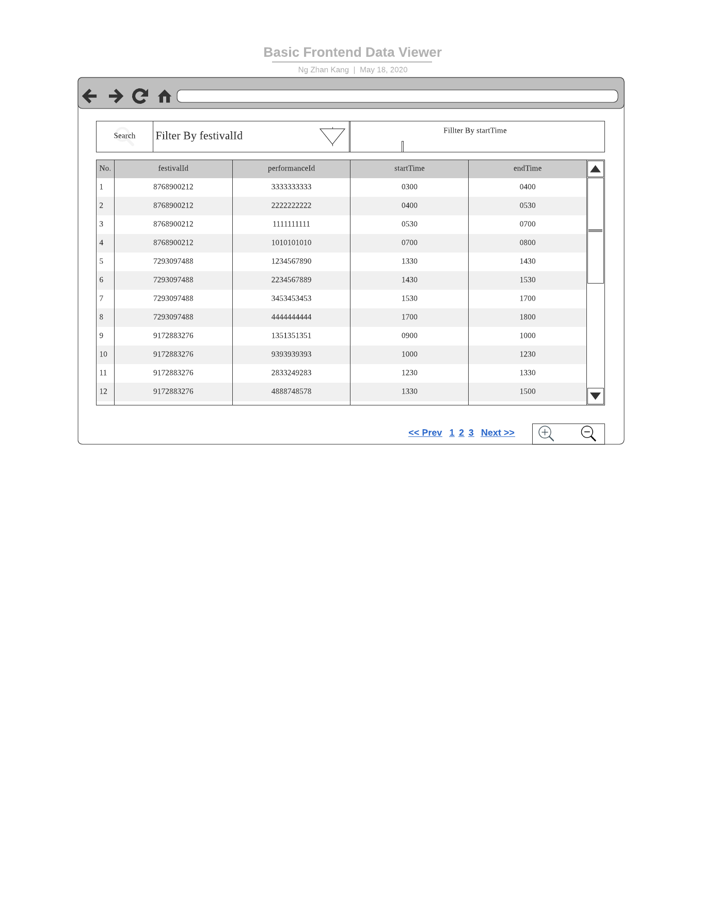
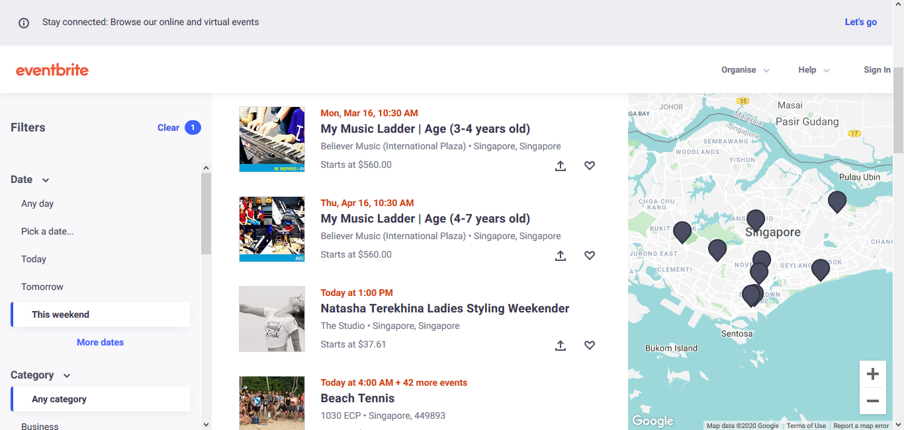
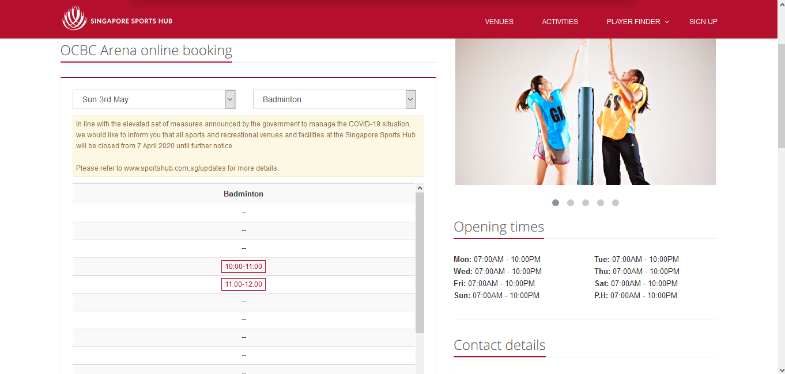
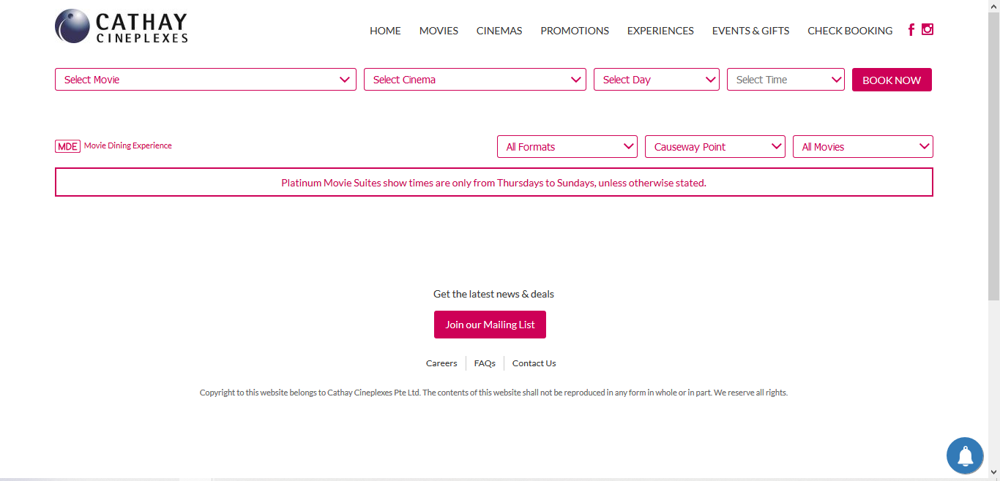

# Wireframe & Justification

This document should help you explain how your user interfaces are designed. You should have a wireframe to give a good overview and some screenshot with simple writeups to justify your designs.

## Wireframe

## Justifications

### [Justification 1 - Data Viewer](https://www.eventbrite.sg/d/singapore--singapore/events--this-weekend/music-festival/?page=1)

#### Good Points
=
1. Good layout of filters.
2. Does not mislead users with its easy functions.
3. Very systematic.

#### Bad Point

1. Too many options. Could have been presented such that a calander is show instead for the user to personally choose his/her desired date.

### [Justification 2 - Data Viewer](https://obs.sportshub.com.sg/view/2483/ocbc-arena)

#### Good Points

1. Allow users to select the specific date they want to attend the concert by displaying a dropdown.
2. White background to let user see as if the page is clean.
3. Also filters the type of sports user wants.

#### Bad Points

1. Only shows limited dates and does not show dates and timing for 3 months into the future.

### [Justification 3 - Data Viewer](https://www.cathaycineplexes.com.sg/)

#### Good Points

1. A dropdown list to let users choose between the venue instead of letting them tyoe themselves.
2. 4 different categories(filters) for the users to narrow down their selection.

#### Bad Points

1. Options for the users to choose the date and time is too small/ placed and squeezed at the top. Old/elder users who might not be tech-savvy or not alert might have accidentally skipped that part.