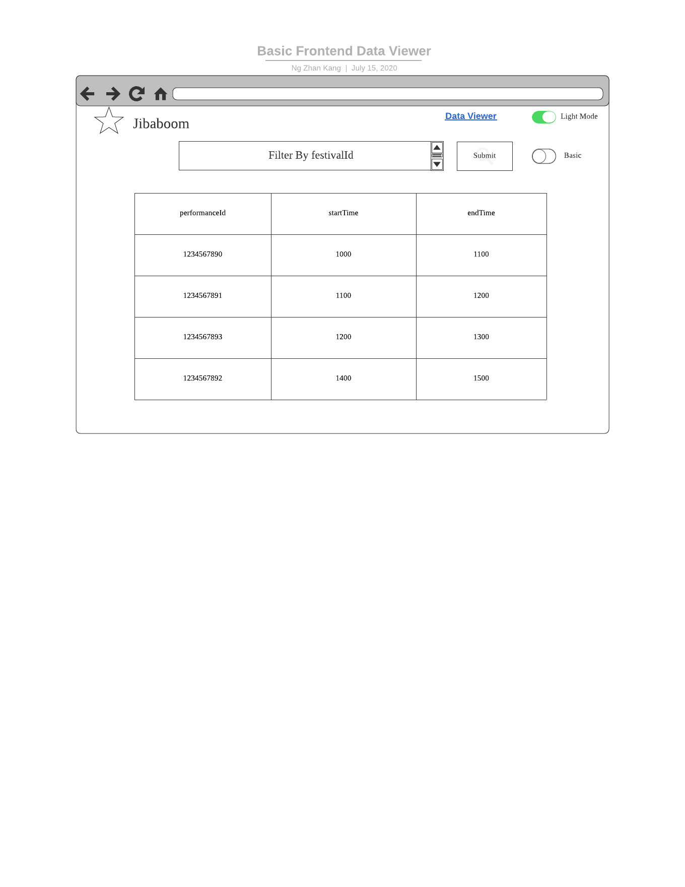
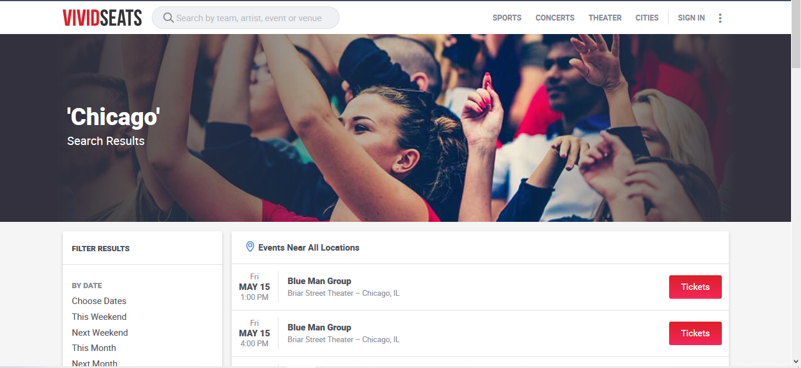
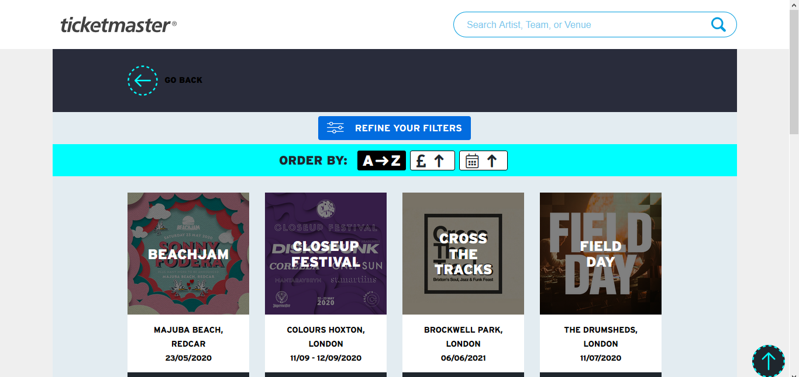

# Wireframe & Justification

This document should help you explain how your user interfaces are designed. You should have a wireframe to give a good overview and some screenshot with simple writeups to justify your designs.

## Wireframe

## Justifications

### [Justification 1 - Result Viewer](https://www.eventbrite.sg/d/singapore--singapore/events--this-weekend/music-festival/?page=1)

#### Good Points

1. Information such as date, time, location and price are displayed quite clearly.
2. Show in 'row - direction' manner such that the message can be spreaded over a larger area and that the banner can be shown clearly.  
3. They have a share button which allows the person to share the website/event with friends/relatives. At the same time they also have a like button to allow the user to favourite the event so that they can come and take a look at the event at a later date if they want to.

#### Bad Points

1. Maybe they could show the popularity of the events so that people can decide if its worth to go to. This is so as we realised that in the real world, not just events, but people usually ask for how popular the product is before purchasing the product.
2. The filters could have been placed at the top so that it is more neat and make it easier for the user to filter as they will not need to scroll up and down.

### [Justification 2 - Result Viewer](https://www.vividseats.com/Search.action?searchTerm=Chicago)

#### Good Points

1. Shows all search results/filter results in rows, which is neat. The filters are mostly not based on user inputs, which are susceptible to human input error. Instead, they provide options for users to choose.
2. Shows the time and the date explicitly beside the name of the festival.
3. Beautiful UI/UX at the top of the search queries.
4. Upon filtering, there will be a tag at the top for the user to view(it's very visible). And if the user decides to revert his choice or option, he can just click the cancel button at the very right side of the tag.

#### Bad Points

1. Maybe they could show the popularity of the shows so that people can decide if its worth.
2. They could have add in more filters like time filters because the most they filter for time is just day or night and not numeric timing filters.
3. The options at the left side of the webpage is length, forcing the user to scroll all the way down to see the options. And they did not even provide any jump to top option, meaning the user has to manually scroll all the way to the top. This brings great incovenience to the user.

### [Justification 3 - Result Viewer](https://guides.ticketmaster.co.uk/festival-finder/?filter=1&tmp=2&camefrom=CFC_Festival_Finder&tm_link=festivalfinder&price=1%2C300&age%5B%5D=adult&festival-search-category%5B%5D=281&festival-search-category%5B%5D=293&festival-search-category%5B%5D=307&festival-search-category%5B%5D=288&festival-search-category%5B%5D=286&festival-search-category%5B%5D=283&festival-search-category%5B%5D=294&festival-search-category%5B%5D=287&duration%5B%5D=single&location_type%5B%5D=city&submit=Submit+Query)

#### Good Points

1. Simplistic UI design that is more suitable/friendly for the younger people.
2. Short and brief description of each event and festivals so that users can be more curious and then explore more of each events.
3. When hovered over each tiles,there will be a description of the headliners for the user to read.
4. The results shown are neatly arranged in a systematic format for users to look at.

#### Bad Points

1. Does not show the timing only until the user click on the buy now button, which redirects them to a new tab/webpage.
2. Only has one filter which might not be ideal. They could have separated the filter into 3 different filters. One for artist, one for team and one for venue.
3. For the prices drag bar(one of the filters), the user has to drag to a specific price. Sometimes, it will not be dragged over to the precise price value that the user wants. Instead they can also provide a input option for user to type in their desired price. 
4. By clicking on the go back option after filtering, users may realise that their time and effort made into doing the filter are gone within seconds. This is bad and instead, they can make a option at the top for users to click OK!