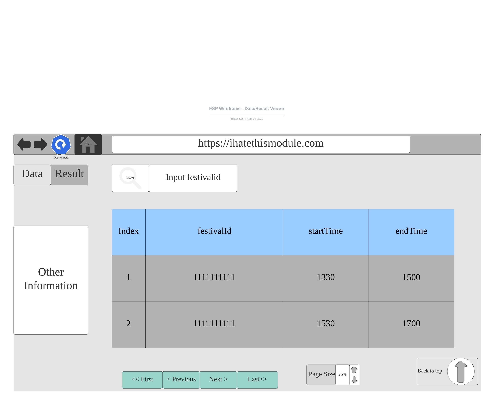
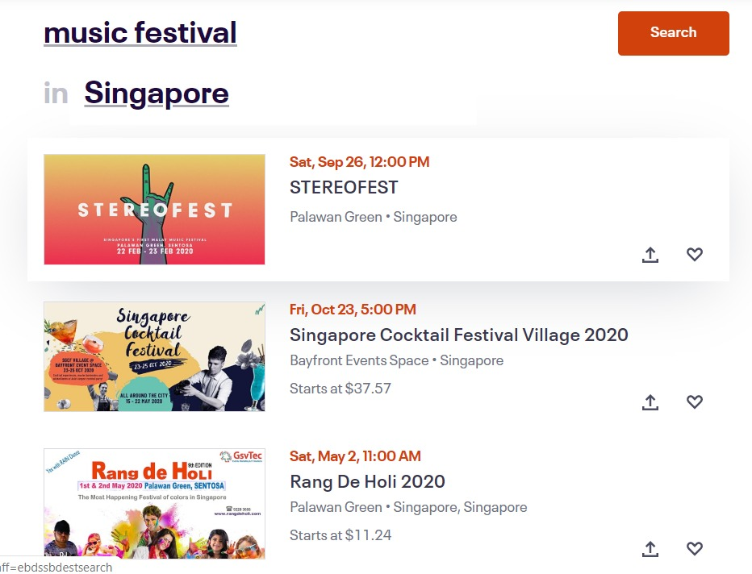
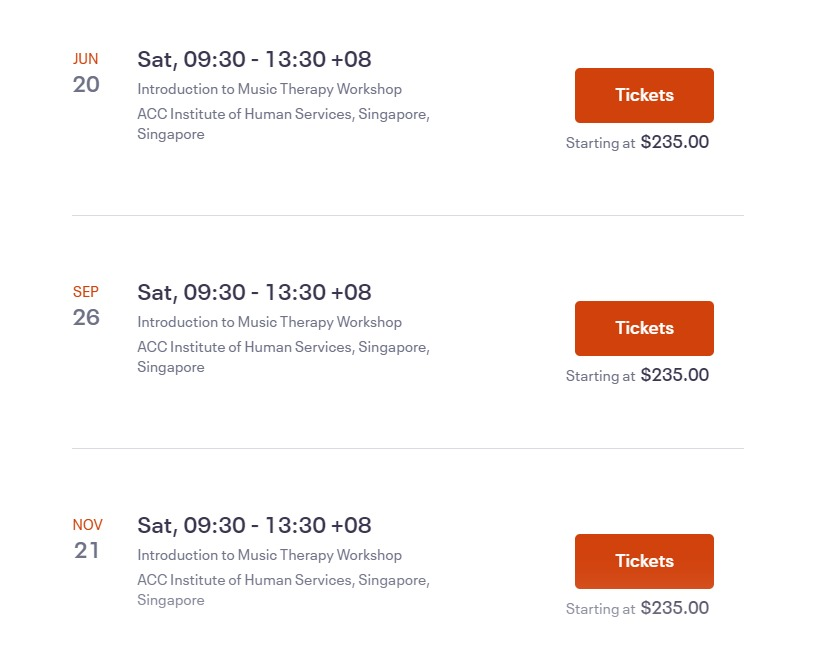
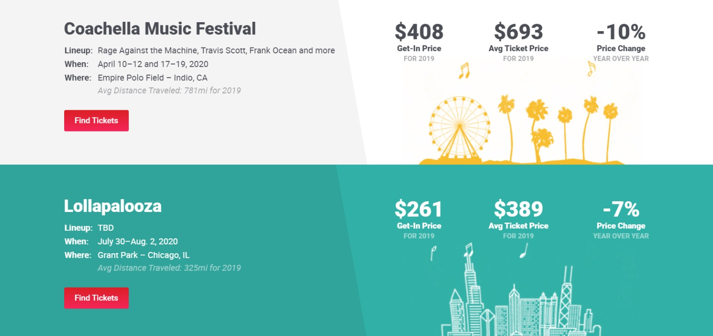

# Wireframe & Justification

This document should help you explain how your user interfaces are designed. You should have a wireframe to give a good overview and some screenshot with simple writeups to justify your designs.

## Wireframe

<!--  -->

## Justifications

### [Justification 1 - Result Viewer](https://www.eventbrite.sg/d/singapore--singapore/events--this-weekend/music-festival/?page=1)

#### Good Points

1. Information such as date, time, location and price are displayed quite clearly.
2. Show in 'row - direction' manner such that the message can be spreaded over a larger area and that the banner can be shown clearly.  
3. They have a share button which allows the person to share the wesite/event with friends/relatives.

#### Bad Points

1. Maybe they could show the popularity of the shows so that people can decide if its worth.

### [Justification 2 - Result Viewer](https://www.eventbrite.sg/e/introduction-to-music-therapy-workshop-tickets-90923830625?aff=ebdssbdestsearch)

#### Good Points

1. Shows the date and time in bolded and larger fonts characters for easy reference.
2. Gives a brief description of the workshop and its venue.
3. Shows the starting price of the ticket at the bottom of the 'Tickets' button.

#### Bad Points

1. Maybe they could show the popularity of the shows so that people can decide if its worth.
2. The title could have been placed above the date so that people are more clear about the event.

### [Justification 3 - Result Viewer](https://www.vividseats.com/concerts/festivals/)

#### Good Points

1. Distinct colours and landmarks to make it easy for users to see the different events.
2. There is price comparison to allow users to make an informed decision before buying tickets.
3. It shows the distance from where they live to the event.

#### Bad Points

1. Maybe they could show the popularity of the shows so that people can decide if its worth.